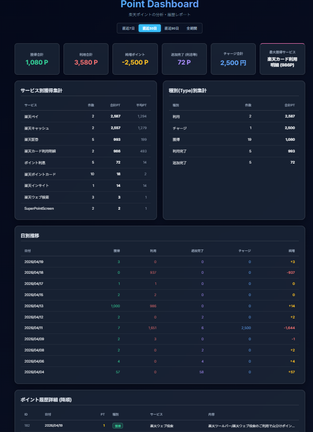

# Rakuten Point Worker & Dashboard



## アプリの 概要
楽天のアカウントに対する自動ログイン、ラッキーくじやポイント獲得などの定期タスクを自動で行うスクリプト群です。
また、自動実行に合わせて直近の「ポイント履歴」を自動で取得・データベースへ保存します。保存されたデータは、スタイリッシュなダークテーマ＆グラスモーフィズムデザインのダッシュボード（Web UI）を通じて、いつでもブラウザから直感的に確認できます。
※ どのような画面イメージなのかは、リポジトリ内の `screenshot.png` をご参照ください。

---

## システムの全体像をアスキーアートで表現

```text
 +---------------------+       (Daily Local Run or Cron)
 |     Cron / Node     | -----------------------+
 +---------------------+                        |
                                                v
 +------------------------------------------------------------------+
 |                         kuji-login.js                            |
 |  [1] 楽天へ自動ログイン    [2] ラッキーくじ自動遷移 (Selenium)      |
 |  [3] キーワード検索実行    [4] ポイント履歴HTMLの保存・パース       |
 +------------------------------------------------------------------+
                                                |
                      (Parse HTML with cheerio) | Upsert Records
                                                v
                                +-------------------------------+
                                |         MySQL Database        |
                                |       (Table: history)        |
                                +-------------------------------+
                                                ^
                                                | (Fetch JSON via /api/histories)
 +---------------------+                        |
 |  Express Server     | -----------------------+
 |  (apiHistories.js)  |
 +---------------------+
           | (Serves public HTML/CSS/JS)
           v
 +---------------------+
 |   Web Dashboard     |
 | (histories.html)    |
 +---------------------+
```

---

## WSL UBUNTUで使う場合の環境構築手順

### MySQLのインストール手順 (事前準備)
WSL上でデータベースを動かすための手順です。
```bash
sudo apt update
sudo apt install mysql-server -y
sudo systemctl start mysql
# WSL起動時に自動起動させたい場合は有効化（環境により異なります）
sudo systemctl enable mysql
```
その後、同梱のSQLを使って初期化（データベースとユーザー作成）を行います。
```bash
sudo mysql -u root < setup_db.sql
```

### CHROMEのバージョンを調べる方法とCHROMEDRIVERの入手方法
WSL上の仮想ディスプレイ(またはheadless)で動かす場合、Chrome本体とChromeDriver両方の手動配置が必要です。
1. **バージョン確認**: インストール済みの場合は `google-chrome --version` などで確認します。
2. **入手方法**: 
   Linux用のChromeは `wget https://storage.googleapis.com/chrome-for-testing-public/.../linux64/chrome-linux64.zip`
   Linux用のChromeDriverは `wget https://storage.googleapis.com/chrome-for-testing-public/.../linux64/chromedriver-linux64.zip`
   のように [Chrome for Testing](https://googlechromelabs.github.io/chrome-for-testing/) ページから**完全に一致するバージョン**をダウンロードし、任意のディレクトリ（例: `~/opt/`）に解凍・配置してください。

---

## WINDOWSで使う場合の環境構築手順

### MySQLのインストール手順 (事前準備)
1. [MySQL 公式サイト (MySQL Installer)](https://dev.mysql.com/downloads/installer/) から Windows 用インストーラーをダウンロードします。
2. インストーラーに従ってセットアップを行い、MySQLのサービスを立ち上げます。
3. MySQL Workbench やコマンドプロンプトから `root` ユーザーで接続し、本リポジトリにある `setup_db.sql` の中身を流し込んで実行してください。これにより、アプリ用のデータベースとユーザーが生成されます。

### CHROMEのバージョンを調べる方法とCHROMEDRIVERの入手方法
1. **バージョン確認**: 普段利用しているChromeブラウザを起動し、右上の「︙（設定）」＞「ヘルプ」＞「Google Chrome について」を開きます。ここに現在のバージョン（例: `124.0.0.0`）が表示されます。
2. **入手方法**: 上記で調べたバージョンに該当する Windows 用（win32/win64）の ChromeDriver を、[Chrome for Testing](https://googlechromelabs.github.io/chrome-for-testing/) からダウンロードしてください。
3. ダウンロードした ZIP を解凍し、中にある `chromedriver.exe` を任意のわかりやすい場所（例: `C:\tools\chromedriver.exe`）へ配置してください。

---

## CONFIGの作り方

アプリが必要とするクレデンシャル情報は設定ファイルで管理します。
リポジトリにある `config.js.sample` をそのまま同じ階層にコピーし、ファイル名を `config.js` に変更してください。その後、自身の環境に合わせて書き換えます。

```javascript
// config.js の記載例
module.exports = {
    email: 'your_email@example.com',                // 楽天のログインID(メールアドレス)
    pass: 'your_password',                          // 楽天のパスワード
    // Windows 例: 'C:\\tools\\chromedriver.exe' (バックスラッシュは2つ重ねる)
    chromedriver: '/home/ubuntu/opt/chromedriver',

    // DB接続情報 (setup_db.sql で指定したものと同じ)
    DB_HOST: '127.0.0.1',
    DB_USER: 'rpointworker',
    DB_PASSWORD: '331155',
    DB_NAME: 'rpointworker',
    csvExportPath: '/path/to/histories.csv'
};
```

---

## Refactor後のディレクトリ構成（責務分離）

```text
src/
  config/
    loadConfig.js
  core/
    browser.js
  db/
    connection.js
    historyRepository.js
  rakuten/
    auth.js
  features/
    webSearch/
      keywordSource.js
      service.js
      run.js
    pointHistoryCollect/
      fetcher.js
      parser.js
      repository.js
      run.js
    dashboard/
      api.js
      server.js
      run.js
    kuji/
      openList.js
      openKuji.js
      run.js
    combined/
      run.js   // 旧kuji-login.js互換
scripts/
  run-web-search.js
  run-point-history-collect.js
  run-dashboard.js
  run-kuji.js
```

---

## 実行方法（機能ごとに独立）

### 1. 依存関係のインストール
```bash
npm install
```

### 2. Web Search 自動実行のみ
```bash
npm run websearch
```

### 3. Point History 収集 + DB保存のみ
```bash
npm run history:collect
```

### 4. ダッシュボードサーバーのみ
```bash
npm run dashboard
# もしくは npm run dev
```
ブラウザで `http://localhost:3010/histories.html` を開いて確認します。

### 5. Lucky Kuji フローのみ（手動利用向け）
```bash
npm run kuji
```

### 6. 従来の統合フロー（後方互換）
```bash
npm start
# = node kuji-login.js
```

---

## 旧ファイルから新モジュールへの責務マッピング

- `kuji-login.js` → `src/features/combined/run.js`（既存統合実行の互換ラッパー）
- `apiHistories.js` → `src/features/dashboard/run.js` / `server.js` / `api.js`
- `db.js` → `src/db/historyRepository.js`（`upsertHistory`は互換エクスポート）
- `point-history-parser.js` → `src/features/pointHistoryCollect/parser.js`（互換エクスポート）
- `kuji-utils.js` → 引き続き共通ユーティリティ（テストも継続）

---

## 後方互換メモ

- `npm start` / `node kuji-login.js` は従来どおり統合フローを実行できます。
- `node apiHistories.js` も従来どおりダッシュボードサーバーを起動できます。
- DBスキーマ（`history`テーブル）には変更を加えていません。
- `config.js` のキー構成はそのまま利用可能です。

